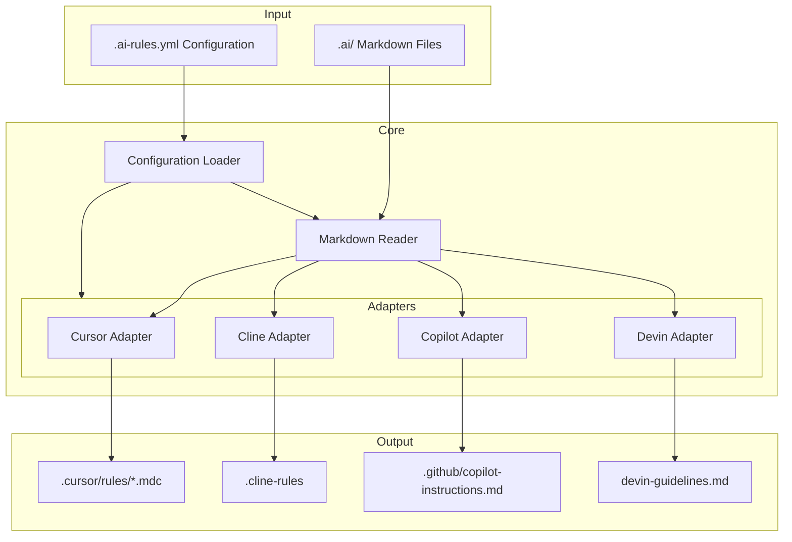
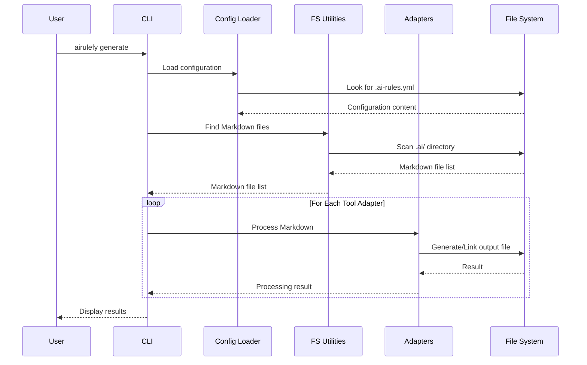

# How It Works

This page explains Airulefy's internal workings and architecture, which may be useful for developers interested in customizing the tool, fixing bugs, or adding new features.

## Architecture Overview

Airulefy implements a simple pipeline to generate configuration files for multiple AI tools from a single source of truth.

## Key Components

### 1. Configuration Management

Airulefy loads configuration from the `.ai-rules.yml` file, using Pydantic models for validation and providing default values.

Key responsibilities:
- Parse configuration file
- Provide default values
- Validate configuration

### 2. Markdown File Processing

Reads all Markdown files from the `.ai/` directory (or configured input path).

Key responsibilities:
- Detect Markdown files
- Read file contents
- Extract metadata if needed

### 3. Tool-Specific Adapters

Each AI tool has a dedicated adapter that converts the Markdown content to the format required by that tool.

Key responsibilities:
- Convert to tool-specific format
- Add necessary metadata or headers
- Determine output destination

#### Supported Adapters

- **Cursor**: Generates `.mdc` files in the `.cursor/rules/` directory
- **Cline**: Generates standard Markdown in the `.cline-rules` file
- **Copilot**: Generates GitHub Copilot instructions in `.github/copilot-instructions.md`
- **Devin**: Generates Devin guidelines in `devin-guidelines.md`

### 4. File System Operations

Creates files according to the configured mode (symlink or copy).

Key responsibilities:
- Create output directories
- Generate files in appropriate mode (symlink or copy)
- Handle existing files

### 5. Change Watching (Watch Mode)

When using the `airulefy watch` command, monitors the input directory for changes and automatically regenerates files.

Key responsibilities:
- Monitor file system events
- Trigger regeneration on changes

## Processing Flow

1. Load configuration file (if it exists)
2. Detect Markdown files from input directory
3. Process content with each adapter
4. Generate files in appropriate mode (symlink or copy)
5. Report results

## Extensibility

Airulefy is designed to be easily extended to support new AI tools. To add a new tool, you simply implement the basic adapter interface and add the new tool to the configuration.
