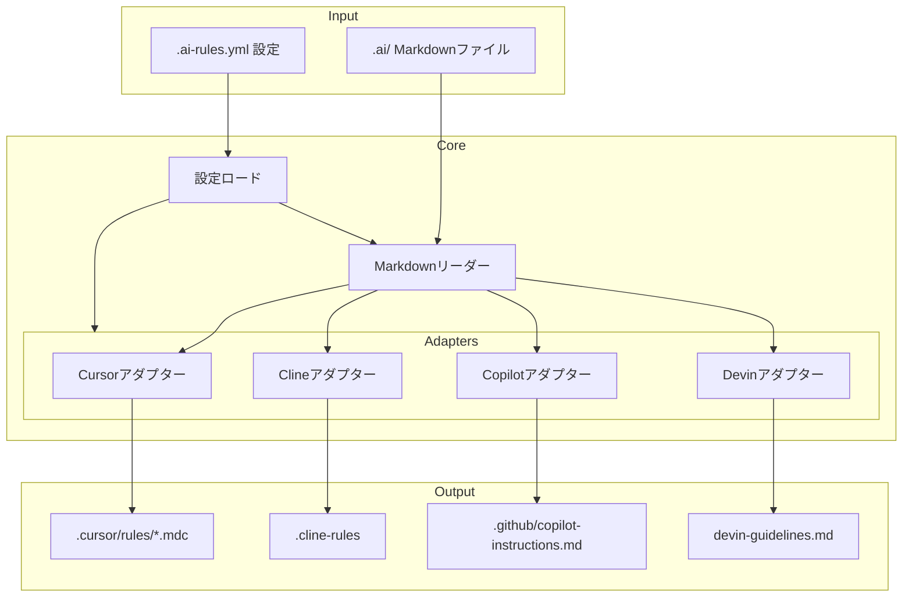
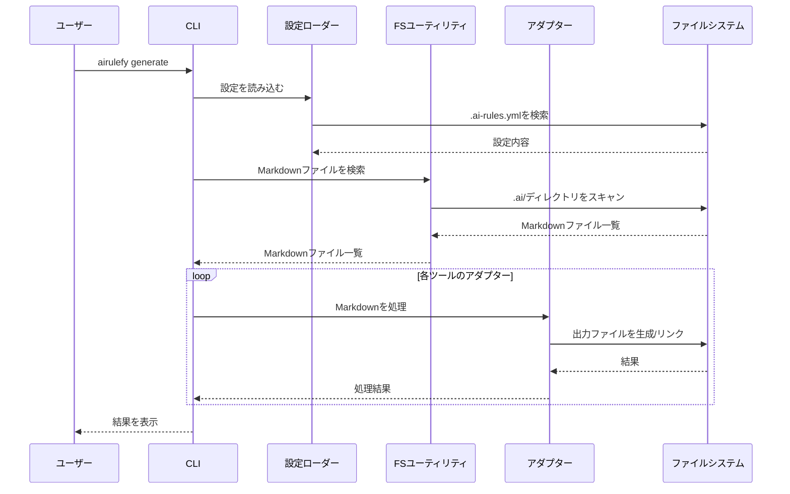

# 動作原理

Airulefyの内部動作とアーキテクチャについて説明します。これは、ツールのカスタマイズや
バグ修正、機能追加に関心のある開発者にとって有用な情報です。

## アーキテクチャ概要

Airulefyは、単一の情報源から複数のAIツール用の設定ファイルを生成するシンプルな
パイプラインを実装しています。

## 主要なコンポーネント

### 1. 設定管理

Airulefyは、`.ai-rules.yml`ファイルから設定を読み込み、Pydanticモデルを使用して検証と
デフォルト値の提供を行います。

主な責任:
- 設定ファイルの解析
- デフォルト値の提供
- 設定の検証

### 2. Markdownファイル処理

`.ai/`ディレクトリ（または設定された入力パス）から全てのMarkdownファイルを読み込みます。

主な責任:
- Markdownファイルの検出
- ファイル内容の読み込み
- 必要に応じたメタデータの抽出

### 3. ツール固有のアダプター

各AIツールには専用のアダプターがあり、Markdownコンテンツをそのツールに適した形式に変換します。

主な責任:
- ツール固有の形式への変換
- 必要なメタデータやヘッダーの追加
- 出力先の決定

#### サポートされているアダプター

- **Cursor**: `.mdc`形式のファイルを`.cursor/rules/`ディレクトリに生成
- **Cline**: 標準的なMarkdownを`.cline-rules`ファイルに生成
- **Copilot**: GitHub Copilot用の指示を`.github/copilot-instructions.md`に生成
- **Devin**: Devin用のガイドラインを`devin-guidelines.md`に生成

### 4. ファイルシステム操作

設定されたモード（シンボリックリンクまたはコピー）に従ってファイルを作成します。

主な責任:
- 出力ディレクトリの作成
- 適切なモードでのファイル生成（シンボリックリンクまたはコピー）
- 既存ファイルの処理

### 5. 変更監視 (watchモード)

`airulefy watch`コマンドを使用すると、入力ディレクトリの変更を監視し、変更があれば
自動的にファイルを再生成します。

主な責任:
- ファイルシステムイベントの監視
- 変更検出時の再生成トリガー

## 処理フロー

1. 設定ファイルの読み込み（存在する場合）
2. 入力ディレクトリからのMarkdownファイル検出
3. 各アダプターでのコンテンツ処理
4. 適切なモード（シンボリックリンクまたはコピー）でのファイル生成
5. 結果の報告

## 拡張性

Airulefyは新しいAIツールに対応するために簡単に拡張できるように設計されています。新しいツールを
追加するには、基本的なアダプターインターフェースを実装し、設定に新しいツールを追加するだけです。
